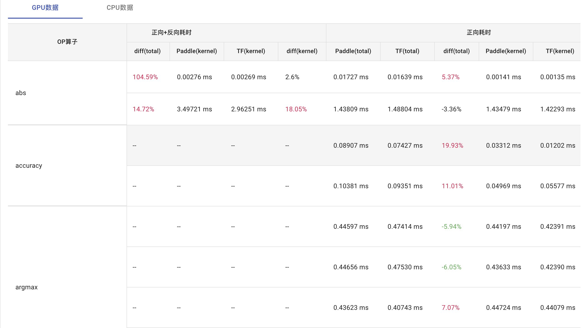

# 目的

该系统的功能是比较 PaddlePaddle（下称paddle）和 tensorflow-gpu（下称tf）执行相同 OP（算子）在CPU和GPU上的性能差异，给出及时反馈。

# 准备

1. 安装框架

    请使用相同版本的python安装 paddle 和 tf。比如，你使用的是`python3.7`，那么请使用`pip3.7`安装`paddle`和`tf`。如果你是从源码或其他途径安装，请确保所以用python版本前后一致。确保两者正确安装且正确执行:

    ```python
    >>> import paddle as pd
    >>> pd.__version__
    >>> import tensorflow as tf
    >>> tf.__version__
    ```

2. 下载 OP Benchmark 源码

    从[这里](https://github.com/PaddlePaddle/benchmark)下载完整的Benchmark源文件，到你的`YOUR_PATH`路径下，进入`YOUR_PATH/benchmark/api/`目录（以下称这个目录为**当前目录**）。


# 配置之前

在考虑使用该系统对某个OP测试之前，请注意以下三点：

1. paddle 和 tf 的OP目前不能完全对应。即一些OP，paddle 可能没有实现，另一些OP，tf 没有实现。

2. 一些OP不存在反向计算操作，所以，没有反向计算测试。

3. 对于OP的性能测试，先要保证其正确性（task: "accuracy"），即一致性通过后，对性能（task: "speed"）测试才有意义。task 配置见下文。

因此，对于一个你想要测试OP，需要提前明确该OP在 paddle 和 tf 中是否有实现，且是否需要反向计算。参考[Benchmark平台](http://yq01-page-powerbang-table1077.yq01.baidu.com:8988/benchmarks/op)：

<div align=center></div>
<div align=center>Benchmark 平台表格局部</div></br>

在链接的表格中，凡是以“--”为值的单元格，表示不支持该计算。比如表格中算子`batch_norm`，在 paddle 有实现，而 tf 没有实现，所以在所有 tf 列，全部标示为“--”。而且由于两者无法比较，diff 列和前向反向一致性，同样全部标记为“--”。

而对于算子`concat`，paddle 和 tf 均有实现，且均需要反向计算，所以`concat`所有列均有实际值。

测试之前请查阅该平台，对所测试任务进行恰当配置。（如何配置，见下文*测试入口*）

# 测试入口

当前目录下的`tests/run.sh`文件是OP的测试入口。

进入目录`tests/`，编辑`run.sh`文件，将最后一行中的`python`改为你所使用的版本。比如，我使用`python3.7`:

```bash
python3.7 -m tests.launch ${OP_BENCHMARK_ROOT}/tests/${name}.py ${run_args}
```

上述命令中的 `tests.launch` 指的是本文档所在目录下的`tests/launch.py`脚本，该脚本接受两个参数：

1. `${OP_BENCHMARK_ROOT}/tests/${name}.py`

    是你想要测试的OP对应的python脚本。所有可用的`OP.py`脚本都在当前目录下。选择你想要测试的OP。

2. `${run_args}`

    这个是测试任务的参数配置，其定义如下：

    ```bash
    run_args="--task ${task} \
            --api_name ${name} \
            --framework ${framework} \
            --json_file ${filename} \
            --config_id ${config_id} \
            --check_output False \
            --profiler none \
            --backward False \
            --use_gpu False \
            --repeat 100 \
            --allow_adaptive_repeat False \
            --log_level 0"
    ```
    每一个参数都有默认值，也可根据测试任务的需要自行配置，只需更改`tests/run.sh`中对应变量值即可。

    参数解释：
    * `--task`: 所测试的任务，可选 accuracy 和 speed。请先测试 accuracy，确保一致性，再测试 speed 性能。
    * `--api_name`: 将要测试的OP名称，与所对应的 `.py` 文件名对应。
    * `--framework`: 可选 paddle，tensorflow，tf，both。
    * `--json_file`: OP对应的配置文件，即这个OP的参数配置方案，文件名为 `OP.json`。几乎每一个OP都有对应的`.json`脚本，位于当前目录下的`configs`目录下。具体内容可查看相应的`.json`脚本。
    * `--config_id`: 使用 `OP.json` 中第几个配置方案。`json` 文件的格式：`[{0号配置}, {1号配置}, {2号配置}, ...]`

    * `--check_output`: 是否返回OP对输出结果对说明。
    * `--profiler`: 选择profiler。选项有"none"，"Default"，"OpDetail"，"AllOpDetail"，"pyprof"。
    * `--backward`: 是否需要反向计算。若False，只进行正向计算；若True，进行正向和反向计算。
    * `--use_gpu`: 是否测试GPU。
    * `--repeat`: 执行次数。
    * `--allow_adaptive_repeat`: 是使用这里的`repeat`还是使用对应json脚本中的`repeat`，具体如何设置。见当前目录下的 [tests/main.py](https://github.com/PaddlePaddle/benchmark/blob/master/api/tests/main.py) 中`_adaptive_repeat()`函数。
    * `--log_level`: 第几层日志

    **注意**：
    * 若使用CPU，需要在`run.sh`修改两处：其一，置`--use_gpu`为False；其二，设置变量`export CUDA_VISIBLE_DEVICES=""`。`run.sh`脚本中也有说明。
    * 若使用GPU，置`--use_gpu`为True，同时指明要使用的GPU编号，如使用第2号GPU：`export CUDA_VISIBLE_DEVICES="2"`
    
    请自定义任务配置，若未自定义，则会使用`tests/run.sh`中的默认的配置。

这个`run.sh`脚本是你唯一需要更改的。对于测试OP，下面是*你需要做的事*。

# 你需要做的事

1. 首先确保已经阅读*配置之前*

2. 选择所测试的OP名称，如`batch_norm`。`configs`中找到OP对应的配置文件，如`batch_norm.json`，选择所需的配置，如第4号配置。

3. 进入`tests/`目录，在`run.sh`中更改自己的python版本，配置所需`run_args`（可使用默认配置）。


4. 执行脚本，你有两个选择：

    * 若第1，2参数未传入（`run.sh`为第0号参数）：

        ```bash
        bash ./run.sh 
        ```

        那么将使用默认值，即`run.sh`中的`name=${1:-"abs"}`和`config_id=${2:-"0"}`。这里测试的是算子`abs`，使用配置文件中的第0号配置。


    * 若参数完整传入：

        ```bash
        bash ./run.sh batch_norm 4
        ```
        此时测试算子`batch_norm`，使用配置文件中第4号配置。

下面的*测试实例*在GPU上测试OP，展示可能的返回结果。

# 测试实例

## 1. 环境：

* Linux 3.10 x86_64
* CUDA 10.0，cudnn 7
* Paddlepaddle 1.8 
* tensorflow-gpu 2.3.0
* python3.7


## 2. 一致性accuracy测试

* 第一步，选择OP及OP配置

    选择`resize_bilinear`，第5个配置。

* 第二步，配置`run_args`

    实例配置如下：

    ```bash
    export CUDA_VISIBLE_DEVICES="2" 
    task="accuracy"     # "accuracy" or "speed"
    framework="both"  # "paddle" or "tensorflow"

    run_args="--task ${task} \
            --framework ${framework} \
            --json_file ${filename} \
            --config_id ${config_id} \
            --check_output True \
            --profiler none \
            --backward True \
            --use_gpu True \
            --repeat 1 \
            --allow_adaptive_repeat False \
            --log_level 0"
    ```
    对算子`resize_bilinear` 测试在GPU上的一致性；执行反向计算；检查输出；由于不是性能测试，`profiler`无输出。**注意**：无论`run.sh`中`framework=""`的赋值是什么，对于任务`accuracy`，都会输出 paddle 和 tf 的对比结果。
    
* 执行`$ bash ./run.sh resize_bilinear 5`，具体返回结果如下(已删除不必要信息)：

    ```
    ===========================================================================
    -- paddle version             : 0.0.0
    -- paddle commit              : 350d20fe5274eddfd97aee810c0fa4f2ca52f11f
    -- tensorflow version         : 2.3.0
    -- benchmark commit           : 573652e4831d5986955dcb41f2eb8a2a68f9bf0b
    -- benchmark last update time : Wed Aug 12 09:42:16 2020 +0800
    ===========================================================================
    run command: /usr/local/bin/python3.7 /paddleDir/paddle_cuda10.1_cudnn7/OPBenchmark/benchmark/api/tests/resize_bilinear.py --task accuracy --framework both --json_file /paddleDir/paddle_cuda10.1_cudnn7/OPBenchmark/benchmark/api/tests/configs/resize_bilinear.json --config_id 5 --check_output True --profiler True --backward True --use_gpu True --repeat 1 --allow_adaptive_repeat False --log_level 0
    ...
    ---- Initialize APIConfig from /paddleDir/paddle_cuda10.1_cudnn7/OPBenchmark/benchmark/api/tests/configs/resize_bilinear.json, config_id = 5.

    [tensorflow][resize_bilinear] resize_bilinear {
        run_tf: True
        atol: 1e-06
        align_corners: True
        align_mode: 1
        data_format: NHWC
        out_shape: [513, 513]
        scale: None
        input_shape: [16, 129, 129, 19]
        input_dtype: float32
    }
    [paddle][resize_bilinear] resize_bilinear {
        run_tf: True
        atol: 1e-06
        align_corners: True
        align_mode: 1
        data_format: NHWC
        out_shape: [513, 513]
        scale: None
        input_shape: [16, 129, 129, 19]
        input_dtype: float32
    }
    ---- The 0-th output (shape: (16, 513, 513, 19), data type: float32) has diff. The maximum diff is 5.451680e-01, offset is 35206075: 0.00706601 vs 0.55223405. atol is 1.00e-06.
    ---- The 1-th output (shape: (16, 129, 129, 19), data type: float32) has diff. The maximum diff is 9.563419e+00, offset is 948537: 6.25 vs 15.813419. atol is 1.00e-06.
    The output is not consistent.
    {"name": "resize_bilinear", "backward": true, "consistent": false, "num_outputs": 2, "diff": 9.563419342041016, "parameters": "input (Variable) - dtype: float32, shape: [16, 129, 129, 19]\nalign_corners (bool): True\nalign_mode (int): 1\ndata_format (string): NHWC\nout_shape (tuple): [513, 513]\nscale (string): None\n"}

    ```
* 对结果进行说明：

    1. 第一部分，实际执行对命令

        `run command` 后是实际执行的命令，从这条命令可以看出这是我需要的**配置信息**。

    2. 第二部分，是两个框架的配置和性能

        对输出结果做解释：

        `---- The 0-th output` 是正向计算输出，两者输出值 0.00706601 和 0.55223405，之差为 5.451680e-01，这个值大于`atol`：1.00e-06。所以输出不一致。

        `---- The 1-th output` 是反向计算输出，两者输出值 6.25 和 15.813419，之差为 9.563419e+00，这个值大于`atol`：1.00e-06。所以输出不一致。

    结论：算子`resize_bilinear`，paddle 和 tf 两者实现的输出不一致。

根据这个步骤，请自行测试。


## 3. 性能speed测试

* 第一步，选择OP及其配置

    选择默认OP及默认配置

* 第二步，配置`run_args`

    ```bash
    task="speed"     # "accuracy" or "speed"
    framework="paddle"  # "paddle" or "tensorflow"
 
    run_args="--task ${task} \
            --framework ${framework} \
            --json_file ${filename} \
            --config_id ${config_id} \
            --check_output False \
            --profiler none \
            --backward False \
            --use_gpu True \
            --repeat 100 \
            --allow_adaptive_repeat False \
            --log_level 0"
    ```
    测试算子abs在paddle上的性能。执行100次前向计算。**注意**对于speed 任务测试，请将paddle 和 tf 的测试分开进行，对比测试还需完善。

* 执行`$ bash ./run.sh`，返回结果如下(已删除不必要信息)：

    ```
    ===========================================================================
    -- paddle version             : 0.0.0
    -- paddle commit              : e8d5868e9720ee7b5bd8c9ff1cf2e6e7b7f1998a
    -- tensorflow version         : 2.3.0
    -- benchmark commit           : 573652e4831d5986955dcb41f2eb8a2a68f9bf0b
    -- benchmark last update time : Wed Aug 12 09:42:16 2020 +0800
    ===========================================================================
    run command: nvprof /usr/local/bin/python3.7 /paddle_container/OPbenchmark/benchmark/api/tests/abs.py --task speed --framework paddle --json_file /paddle_container/OPbenchmark/benchmark/api/tests/configs/abs.json --config_id 0 --check_output False --profiler none --backward False --use_gpu True --repeat 100 --allow_adaptive_repeat False --log_level 0
                Type  Time(%)      Time     Calls       Avg       Min       Max  Name
    GPU activities: 58.46%  210.67ms         4  52.667ms  1.7280us  210.66ms  [CUDA memcpy HtoD]
                    41.54%  149.69ms       101  1.4821ms  1.4507ms  1.5254ms  void Eigen::internal::EigenMetaKernel<Eigen::TensorEvaluator<Eigen::TensorAssignOp<Eigen::TensorMap<Eigen::Tensor<float, int=1, int=1, long>, int=0, Eigen::MakePointer>, Eigen::TensorCwiseUnaryOp<Eigen::internal::scalar_abs_op<float const >, Eigen::TensorMap<Eigen::Tensor<float const , int=1, int=1, long>, int=0, Eigen::MakePointer> const > const > const , Eigen::GpuDevice>, long>(float, int=1)

    percent: 0.58; gpu_time: 210.6700 ms; calls: 4; function: [CUDA memcpy HtoD]
    total gpu_time: 360.3661 ms
    ...
    run command: /usr/local/bin/python3.7 /paddle_container/OPbenchmark/benchmark/api/tests/abs.py --task speed --framework paddle --json_file /paddle_container/OPbenchmark/benchmark/api/tests/configs/abs.json --config_id 0 --check_output False --profiler none --backward False --use_gpu True --repeat 100 --allow_adaptive_repeat False --log_level 0  --gpu_time  360.3660622647964
    ...
    ---- Initialize APIConfig from /paddle_container/OPbenchmark/benchmark/api/tests/configs/activation.json, config_id = 0.

    [paddle][abs] abs {
    run_tf: True
    alias_config: [paddle][activation] activation {
        x_shape: [16, 128, 257, 257]
        x_dtype: float32
    }
    repeat: 5000
    atol: 1e-06
    }
    {"framework": "paddle", "version": "0.0.0", "name": "abs", "device": "GPU", "backward": false, "speed": {"repeat": 100, "begin": 10, "end": 90, "total": 1.489502191543579, "wall_time": 0.034362077713012695, "total_include_wall_time": 1.5238642692565918, "gpu_time": 3.6036606226479644}, "parameters": "x (Variable) - dtype: float32, shape: [16, 128, 257, 257]\n"}
    ```

* 对结果进行说明

    `run command` 表示实际执行了两条命令，前者给出 kernel 函数在 GPU 上执行时间，和数据传输时间，而且给出了所占总时间对百分比。后者给出该算子在 paddle 上对实现 total 时间为：1.489502191543579，kernel 时间为：3.6036606226479644。


根据这个步骤，请自行测试。


# 部分指标解释

在自行测试的过程中，对于consol的返回结果，下面对可能遇到的返回结果的指标做解释：

* `"repeat": 100, "begin": 10, "end": 90`：
        
    执行次数是100，从第10次开始，将执行时间纳入统计，直到第90次，计算执行时间的平均时间。

* `"total": 347.29254841804504`：

    **CPU-time**，指所有处理单元的执行时间的总和。

* `"wall_time": 0.01703798770904541`：

    **Wall-time**，指进程从开始到结束，走过到时间。可以看出 Wall-time 远远小于 CPU-time，表示本次测试的并行程度很高。


* `"gpu_time": 0.0`：

    表示从`nvprof`中得到的 kernel 的执行时间。如果测试使用 CPU，那么此处为0.0。

* `dtype: float32`：

    测试所使用的数据类型。

* `shape: [16, 128, 257, 257]`：

    测试所使用的数据大小。

# 结束

根据上述步骤，读者可进一步探索测试。